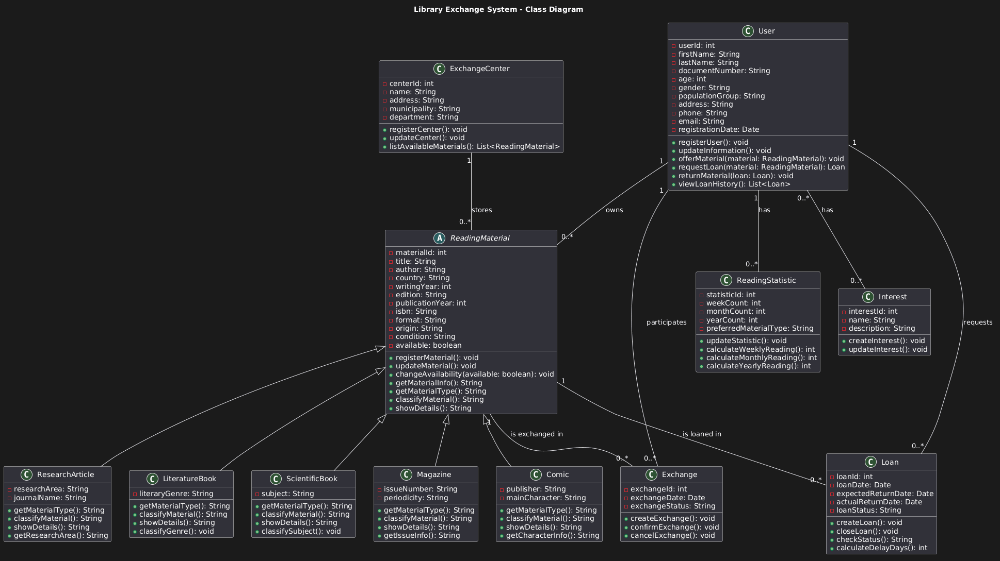

# Sistema de Clasificación de Textos

Proyecto desarrollado en Python para implementar la fase 2 del caso práctico, tomando como base el diagrama de clases UML del sistema de clasificación e intercambio de textos.

## Conceptos aplicados

- Clases
- Objetos
- Encapsulamiento
- Herencia
- Polimorfismo
- Relaciones entre clases

## Diagrama de Clases

A continuación se muestra el diagrama de clases del sistema:

## Estructura del proyecto

- `diagrams/class-diagram.puml`: Código del diagrama en PlantUML
- `diagrams/class-diagram.png`: Imagen del diagrama

## Tecnologías utilizadas

- UML (Lenguaje Unificado de Modelado)
- PlantUML

## Notas

El diagrama representa la estructura del sistema a nivel lógico, incluyendo clases como `User`, `ReadingMaterial`, `Loan`, `Exchange`, entre otras, así como sus relaciones.

## Autor

Trabajo académico - Unidad 2
